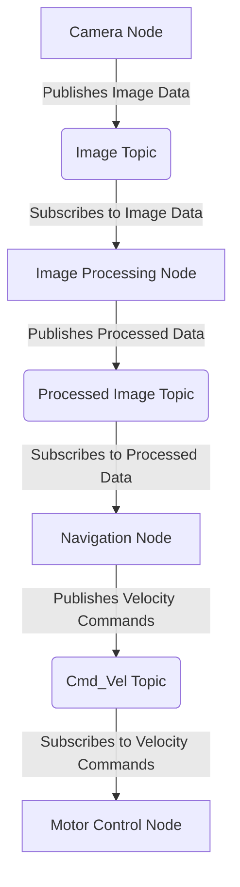

# Chapter No.1: Intro

Welcome to Module 1! In this module, we'll begin our journey into the fascinating world of Robotic Operating System 2 (ROS 2), which we can think of as the **nervous system for robots**. Just as your nervous system allows different parts of your body to communicate and coordinate actions, ROS 2 provides a flexible framework for different software components of a robot to interact and work together.

## What are ROS 2 Nodes?

Imagine a robot as a team of specialized workers. Each worker has a specific job: one might be responsible for controlling the wheels, another for processing camera images, and yet another for planning the robot's path. In ROS 2, these individual workers are called **nodes**.

*   **Nodes are executable processes**: Each node is a separate program designed to perform a specific task.
*   **Modular design**: This modularity makes it easy to develop, test, and debug individual functionalities without affecting the entire robot system.
*   **Example**: A `camer-node` might capture images, a `motor_control_node` might send commands to motors, and a `navigation_node` might calculate routes.

## What are ROS 2 Topics?

Now that we have our specialized workers (nodes), how do they talk to each other? They use **topics**! Think of topics as named communication channels or broadcasting stations. A node can *publish* information to a topic, and other nodes can *subscribe* to that topic to receive the information.

*   **Publishers**: Nodes that send data to a topic.
*   **Subscribers**: Nodes that receive data from a topic.
*   **Decoupled communication**: Publishers and subscribers don't need to know about each other directly; they only need to agree on the topic name and the type of message being sent.
*   **Message Types**: Data sent over topics are structured messages (e.g., `sensor_msgs/Image` for camera data, `geometry_msgs/Twist` for velocity commands).

### Analogy: A Radio Station

Consider a radio station. The radio station (publisher) broadcasts music (messages) on a specific frequency (topic). Anyone with a radio (subscriber) tuned to that frequency can receive the music. The radio station doesn't care who is listening, and the listeners don't need to know how the music is produced; they just need to be tuned in.

## Pub/Sub Architecture with Mermaid

This communication pattern, where nodes publish and subscribe to topics, is known as the **Publish/Subscribe (Pub/Sub) architecture**. Here's how it looks:

In this diagram:

*   **Rounded boxes** like `Image Topic` represent **topics** (communication channels).
*   **Square boxes** like `Camera Node` represent **nodes** (individual processes).
*   **Arrows** indicate the flow of data: `Publishes` (sends data) or `Subscribes` (receives data).

This modular and distributed approach is what makes ROS 2 so powerful for building complex robotic applications!