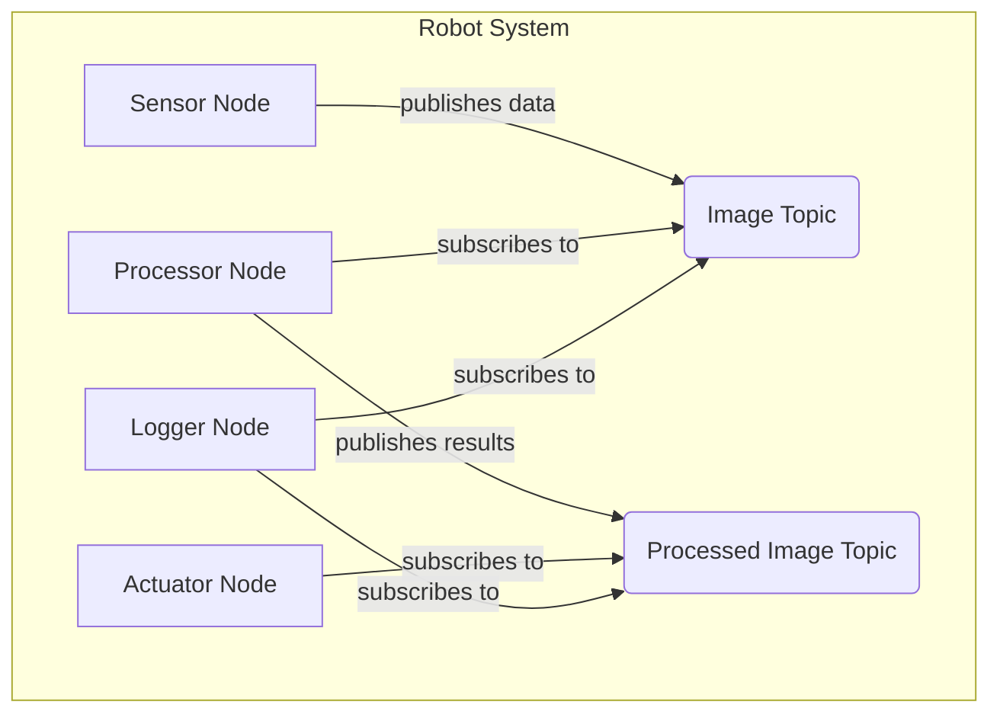

# Chapter No.4: Topics

In our exploration of ROS 2, we've established that nodes are the individual workers in our robot's nervous system. But how do these independent nodes share information and coordinate their actions? This is where **ROS 2 Topics** come into play. Topics implement a powerful communication pattern known as Publish/Subscribe (Pub/Sub), allowing for one-to-many, anonymous, and asynchronous data flow throughout the robot's software.

## The Publish/Subscribe Model

Imagine a radio station (a publisher) broadcasting news, weather, or music. Anyone with a radio (a subscriber) can tune into that station and receive the broadcast without the radio station knowing who is listening. ROS 2 Topics work in a similar way:

*   **Publisher**: A node that sends data (messages) on a specific topic.
*   **Subscriber**: A node that receives data (messages) from a specific topic.
*   **Topic**: A named channel through which messages flow. Publishers send messages to a topic, and subscribers listen to a topic.

This model is highly flexible:

*   **Anonymous**: Publishers and subscribers don't need to know about each other's existence. They only need to agree on the topic name and message type.
*   **Asynchronous**: Messages are sent and received independently. Publishers don't wait for subscribers, and subscribers process messages as they arrive.
*   **Decoupled**: Nodes can be developed and deployed independently, as long as their communication interfaces (topics) are consistent.

## Diagram: ROS 2 Pub/Sub Architecture

The following diagram illustrates how multiple nodes can communicate using the Pub/Sub model via topics.

### Diagram Explanation:

*   **`Sensor Node`**: This node might represent a camera driver that captures images.
*   **`Image Topic`**: The channel through which raw image data is sent.
*   **`Processor Node`**: This node subscribes to the `Image Topic` to receive raw images. After performing some processing (e.g., object detection), it publishes the results to `Processed Image Topic`.
*   **`Processed Image Topic`**: The channel for processed image data.
*   **`Actuator Node`**: This node might control a robot arm or wheel motors. It subscribes to `Processed Image Topic` to receive instructions based on the processed images (e.g., "move towards the detected object").
*   **`Logger Node`**: This node subscribes to both `Image Topic` and `Processed Image Topic` to record all incoming and outgoing data for debugging or analysis, demonstrating that multiple subscribers can listen to the same topic.

## Key Characteristics of Topics

*   **Message Types**: Every topic uses a specific message type (e.g., `std_msgs/msg/String`, `sensor_msgs/msg/Image`). Publishers and subscribers must use the same message type to communicate successfully.
*   **Quality of Service (QoS)**: ROS 2 allows you to configure QoS settings for topics, controlling aspects like reliability (guarantee delivery), durability (retain messages for new subscribers), and history (keep a certain number of past messages). These settings are crucial for different types of data (e.g., sensor data might prioritize speed over guaranteed delivery, while control commands might prioritize reliability).

## When to Use Topics

Topics are ideal for:

*   **Continuous, streaming data**: Sensor readings (IMU, lidar, camera), robot odometry, state updates.
*   **One-way communication**: When a node needs to broadcast information without expecting a direct response from specific listeners.
*   **Decoupling components**: Allowing different parts of the robot's software to operate independently.